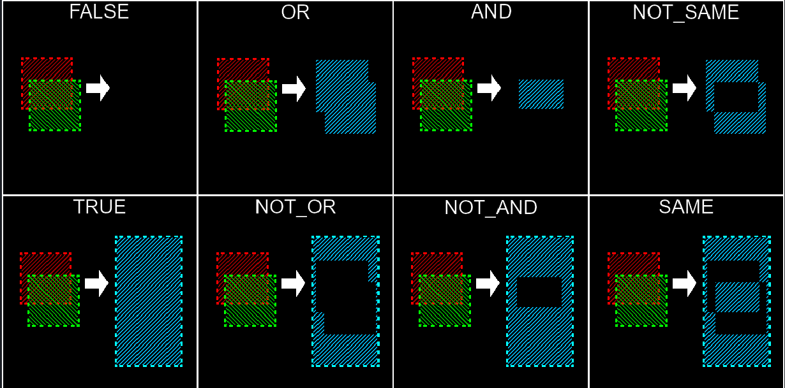
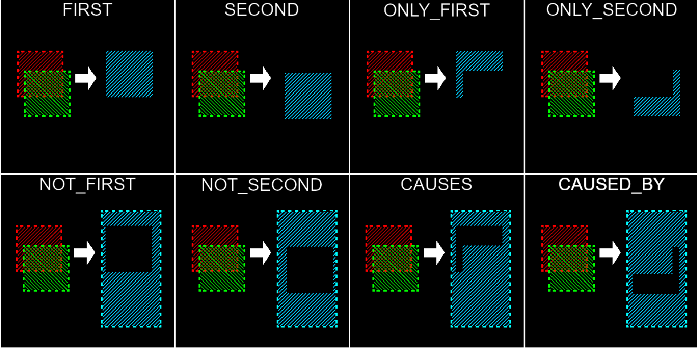

# 别忘了

## jvav相关

- 把™的 Extension Pack for Jvav 给禁用掉，sb东西一个
- .\gradlew.bat clean build 构建模组
- .\gradlew.bat runClient 启动客户端
- gradlew 的警告千万别修，修了会影响逻辑，能跑的情况下这些警告全是氛围灯，心情好再修

## 材质相关

- blockbench右键拖住可以平移
- blockbench如果要导出1.12.2的Jvav模型，需要先新建1.12.2的Jvav Entity模型，然后导入现有的bbmodel文件
- blockbench里面的各个部位的枢轴点记得要调对，不然盔甲位置会错乱，枢轴点参考Armor(main)和Armor(leggings)里面自带的，这样导出后的setRotationPoint方法里面的参数才是正确适配mc的
- 如果模型位置很奇怪可能是json和渲染文件的旋转重叠作用
- 需要搞水池那种方块的话需要用Jvav版物品/方块
- 控制手拿在某个方块的哪里的方法：
  - 把枢轴点放到想要拿的地方
  - 在 `poseStack.translate` 里面设置补偿值
- 如果需要做普通jvav版方块，需要在显示调整里面把所有显示的地方的显示形式换成默认方块
- 碰撞箱：
  In order to use the VoxelShape exporter, you first need to create a new Group, called "VoxelShapes". All cubes that you create within this group, will be added to the voxelShape trough the OR BooleanFunction. Additionally you can add sub groups with the name equaling a "$" and a BooleanFunction as shown in the image below (Ex: $and). The first cube in such a group represents the red cube, all other ones will be combined with an OR BooleanFunction first.  
  There is an advanced settings menu for the VoxelShape exporter that allows you to disable the requirement of the "VoxelShapes" group. This option is only designed to be used for rapid prototyping and should not be used in production. For the best performance, you should be creating a representation of your VoxelShape in a separate model and use the BooleanFunctions to create the proper shape rather than ORing all of the cubes in your model together. If not using BooleanFunctions, use the "VoxelShapes" group to make sure that only the cubes you need are being used for the VoxelShape. The less cubes, the better.  
    
    
  碰撞箱使用voxel.py生成
- 釜碰撞箱问题：釜内往墙壁走会被弹回、按住 shift 出现黑色窒息遮挡。根因是客户端加载区块时 BlockState 先于 BlockEntity 到达，在 BE 未就绪时 `getCollisionShape` 回退到 `Shapes.block()`，18 个方块瞬间变成完整方块碰撞。修复：formed 状态下 BE 不可用时回退改为 `Shapes.empty()`；方块注册添加 `dynamicShape()`、`isSuffocating(false)`、`isViewBlocking(false)`。

## md语句相关

- 3*3的chart模板
    <table class="board">
    <tr>
        <td>null</td><td>null</td><td>null</td>
    </tr>
    <tr>
        <td>null</td><td>null</td><td>null</td>
    </tr>
    <tr>
        <td>null</td><td>null</td><td>null</td>
    </tr>
    </table>

## 模组实现相关

- 做相同的东西的时候记得抽象出一个基类
- cursor 闲置的时候记得检查一下代码质量，硬编码之类的
- wthit 就是个傻逼模组，有问题别管
- 绿色魔法的粒子特效是粒子特效的占位符，以后会实现具体粒子特效
- 树叶被破坏的音效是音效的占位符，以后会实现具体音效

## VPN

- https://b4zk7yqa.onelink.me/Lm5M/khng1wzk
